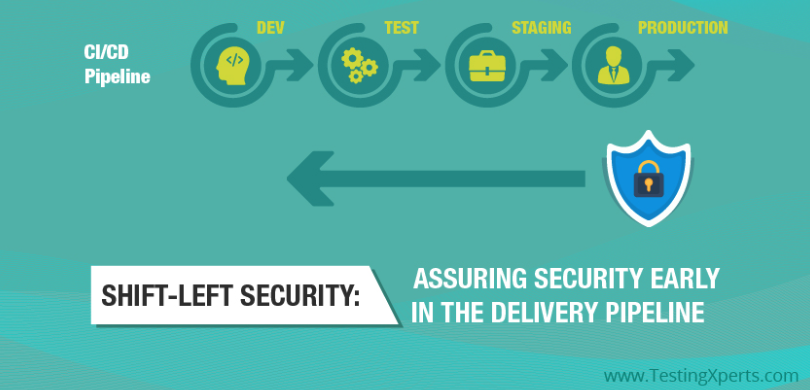
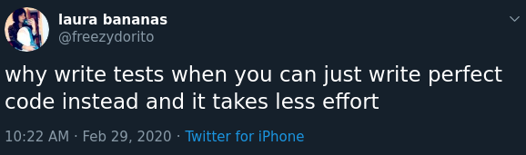
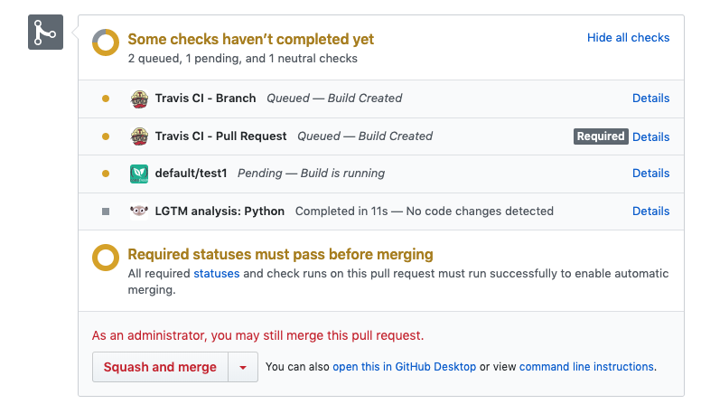
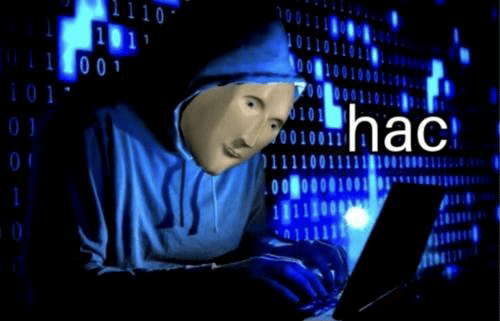

---?image=assets/img/light_left.jpeg
@title[Shifting Left]

@snap[east]
@img
@snapend

Note:

- You can **follow along** with this talk on my github (hotpeppersec).
- There are links throughout the presentation that you can click on for greater detail.
- I realize this presentation is currently a bit wonky when viewed on a mobile device.
  - I'm working on it, don't @ me.
- My speaking style is fairly informal and if you stop me with a question I will do my best to answer it.

---?image=assets/img/black_and_blue.jpeg
@title[Bio]

@snap[west]
@img[span-50](assets/img/us.jpg)
@snapend

@snap[north-east span-45 text-08]
@box[bg-purple text-yellow](Current#Consulting Engineer at Palo Alto Networks)
@snapend

@snap[east span-45]
@box[bg-blue text-yellow text-08](Previous#Motorola R&D Eng at Nokia Siemens SecDataSci [@SecureCloudDev](https://twitter.com/SecureCloudDev))
@snapend

@snap[south-east span-45 text-08]
@box[bg-pink text-yellow](Education#MS DePaul University MS Northwestern BS in Comp Sci)
@snapend

Note:

- CE gets called in to assist SE's as a subject matter expert.
- Tech Lead in cellular base station product dev at Moto.
- Bought out by NSN
- Wound up at Salesforce doing security data science.
  - Use ML to deal with 1B security logs per day.
- MS in network eng, network security

---?image=assets/img/light_left.jpeg
@title[What]

@snap[north-west span-100 text-20 text-bold text-right text-orange]
Shift What?
@snapend

@snap[midpoint span-180 text-right text-07 text-orange]
@ul[circles](true)

- Address bugs and issues at the earliest.
- Early amalgamation of security concerns and dev concerns.
  - Not always (never?) the same set of goals!

@ulend
@snapend

@snap[south span-40]

@snapend

Note:

- Cool graphic stolen from testingxperts.com, so be sure to check them out since they are an unwitting sponsor.
- This talk comes at it from the viewpoint of a sec person who needs to get the dev teams on board.
- we often hear that sec is **everyones responsibility**
  - Resolve issues sooner than w/traditional methods.
- The impact of software issues (bugs) is amplified as we move down the path of software lifecycle.
  - Reduce the imact, costs, and likelihood of security issues by identifying and correcting sooner.

---?image=assets/img/light_left.jpeg
@title[Uniformity]

@snap[north-west span-100 text-20 text-bold text-right text-orange]
Uniformity
@snapend

@snap[south-east span-180 text-right text-08 text-orange]
@ul[circles](false)

- Your situation is not so unique that you qualify for an exception.
- Drive out fragmented security process.
  - Security tends to vary by application/location/team.
  - Disparate systems contribute to gaps in network security posture.
- Avoid looking at "slices" of traffic or applications.
  - Go for holism.

@ulend
@snapend

Note:

- No special configs or situations!
- Try to take the 100K foot view to see the big picture as well.
  - Consider how all the parts fit together.

---?image=assets/img/light_left.jpeg
@title[Agile]

@snap[north-west span-100 text-20 text-bold text-right text-orange]
Leverage Agile Practices
@snapend

---?image=assets/img/light_left.jpeg
@title[Heavy]

@snap[north-west span-100 text-20 text-bold text-left text-orange]
Beware the Heavy Hand
@snapend

---?image=assets/img/light_left.jpeg
@title[Scrutiny]

@snap[north span-100 text-20 text-bold text-orange]
Open it Up
@snapend

@snap[south span-200 text-right text-08 text-orange]
@ul[circles](true)

- Document your processes.
- Open Source your tools.
- Solicit feedback and scrutiny.

@ulend
@snapend

@snap[midpoint span-40]

@snapend

Note:

- Subject your work to constructive criticism!
- You are most likely benefitting from open source software. Try to give back.

---?image=assets/img/light_left.jpeg
@title[UseIt]

@snap[north span-100 text-20 text-bold text-orange]
Master the Tools
@snapend

Note:

- There are tons of free tools out there. Learn and use them.

---?image=assets/img/light_left.jpeg
@title[Testing]

@snap[north span-100 text-20 text-bold text-orange]
More Testing!
@snapend

@snap[south-east span-100 text-right text-08 text-orange]
@ul[circles](true)

- Everyone understands testing, conceptually.
- Very few seem to be following through!
  - Tons of code out there, not a lot of test cases.

@ulend
@snapend

@snap[midpoint span-65]

@snapend

Note:

- We've all sat through the class or read the blog about the need for testing.
- Why aren't you testing?
  - You can browse GitHub and see most projects don;t include tests.

---?image=assets/img/light_left.jpeg
@title[Coverage]

@snap[north-west span-100 text-20 text-bold text-right text-orange]
Keep an Eye on Test Coverage
@snapend

@snap[midpoint span-200 text-08 text-orange]
@ul[circles](false)

- Monitor the percentage of test coverage.
  - For example: [coveralls.io](https://coveralls.io/)
- Create unit & functional tests to keep coverage high.

@ulend
@snapend

@snap[south span-50]

@snapend

Note:

- In the Python world, use "coverage" module with maybe Tox & Pytest.

---?image=assets/img/light_left.jpeg
@title[Lint]

@snap[north-west span-100 text-20 text-bold text-right text-orange]
Use the Linters
@snapend

Note:

- Take advantage of free lint tools to keep it tight.

---?image=assets/img/light_left.jpeg
@title[Reviews]

@snap[north-west span-70 text-20 text-bold text-right text-orange]
Code Reviews
@snapend

Note:

- Don't skip them.

---?image=assets/img/light_left.jpeg
@title[CI]

@snap[north-west span-70 text-20 text-bold text-right text-orange]
Automate Checks via CI
@snapend

@snap[midpoint span-40]

@snapend

Note:

- run your tests & linters when people check in new code
  - GitHub Actions
  - CodeFresh
  - Travis
  - GitLab CI
  - Circle CI
- Don't trust Sec/Dev to run ther tests.

---?image=assets/img/light_left.jpeg
@title[Scan]

@snap[north-west span-100 text-20 text-bold text-right text-orange]
Free Scanners
@snapend

Note:

- LGTM.com

---?image=assets/img/light_left.jpeg
@title[Policy]

@snap[north-west span-100 text-20 text-bold text-right text-orange]
Have a Plan!
@snapend

@snap[east span-55 text-right text-08 text-orange]
@ul[circles](false)

- Things never turn out the way we envision them. Stuff Happens.
- Folks need to know how to reach you/your team with issues.
- For GitHub.com, [use of SECURITY.md for example](https://github.com/hotpeppersec/shifting_left/security/policy).
  - You can also issue security advisories to your user base this way.

@ulend
@snapend

@snap[west span-40]

@snapend

---?image=assets/img/light_left.jpeg
@title[Red]

@snap[north-east span-75 text-14 text-bold text-orange]
Fun for the Red Team Too
@snapend

@snap[midpoint span-250 text-07 text-orange]
@ul[circles](false)

- [Testing Red Team Infra](https://blog.xpnsec.com/testing-redteam-infra/) by [@_xpn_](https://twitter.com/_xpn_)
- [Offensive Dev with GitHub Actions](https://www.mdsec.co.uk/2020/03/offensive-development-with-github-actions/) by [@MDSecLabs](https://twitter.com/MDSecLabs)

@ulend
@snapend

@snap[south span-30]

@snapend

Note:

- First link is terraform/ansible/molecule, red team Infra as Code
- Second link is using GitHub Actions to interface with Cobalt Strike.

---?image=assets/img/light_left.jpeg
@title[Thank You]

@snap[north-west span-100 text-20 text-bold text-center text-orange]
Thank You
@snapend

@snap[south-west span-200 text-left text-08 text-orange]
@ul[circles](false)

- [GitPitch Slide Decks for Developers](https://gitpitch.com/pricing)
- The @gitlink[source for these slides is available here](shifting_left) on my GitHub account (@hotpeppersec)
- All the folks who took time to review and provide feedback!

@ulend
@snapend

@snap[midpoint]

@snapend
