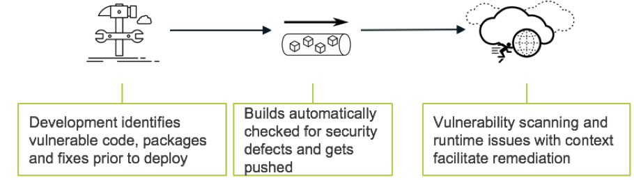

---?image=assets/img/light_left.jpeg
@title[Shifting Left]

@snap[north span-100 text-20 text-bold text-center text-orange]
Shifting Left
@snapend

@snap[south span-100 text-11 text-center text-orange]
More security, earlier in the software development life cycle
@snapend

@snap[midpoint]
@img[span-120](assets/img/title.png)
@snapend

---?image=assets/img/light_left.jpeg
@title[Introduction]

@snap[north-west span-100 text-20 text-bold text-center text-orange]
Introduction
@snapend

@snap[south-west span-35 text-08]
@box[text-orange](You can [follow along on GitPitch](https://github.com/hotpeppersec/shifting_left) if you like)
@snapend

@snap[south span-35 text-08]
@box[text-orange](Please use ["issues" for feedback/error reporting](https://github.com/hotpeppersec/shifting_left/issues))
@snapend

@snap[south-east span-35 text-08]
@box[text-orange](OK to interrupt w/questions [or send me a tweet](https://twitter.com/TheDevilsVoice))
@snapend

@snap[midpoint]
@img[span-80](assets/img/game_on.jpeg)
@snapend

Note:

- You can **follow along** with this talk on my github (hotpeppersec).
  - There are links throughout the presentation that you can click on for greater detail.
- I realize this presentation is currently a bit wonky when viewed on a mobile device.
  - I'm working on it, don't @ me.
- Please do provide feedback via "issues"
- My speaking style is fairly informal and if you stop me with a question I will do my best to answer it.
- [issues](https://github.com/hotpeppersec/shifting_left/issues)
- I will attempt to strike a balance begtween tactical and logistical concerns

---?image=assets/img/black_and_blue.jpeg
@title[Bio]

@snap[west]

@snapend

@snap[north-east span-45 text-08]
@box[text-yellow](Current Work#Consulting Engineer at Palo Alto Networks)
@snapend

@snap[east span-45 text-06]
@box[text-yellow](Previous Work#- Motorola - R&D Eng at Nokia Siemens - SecDataSci [@SecureCloudDev](https://twitter.com/SecureCloudDev))
@snapend

@snap[south-east span-45 text-08]
@box[text-yellow](Education#- MS DePaul University - MS Northwestern - BS in Comp Sci)
@snapend

Note:

- CE gets called in to assist SE's as a subject matter expert.
- Tech Lead in cellular base station product dev at Moto.
- Bought out by NSN
- Wound up at Salesforce doing security data science.
  - In-house log aggregation solution for sec logs
  - Our team used ML to deal with 1B security logs per day.
- MS in network eng, network security

---?image=assets/img/light_left.jpeg
@title[What]

@snap[north-west span-100 text-20 text-bold text-center text-orange]
Shift What?
@snapend

@snap[midpoint span-80]

@snapend

@snap[south-west span-35 text-08]
@box[text-orange](Address bugs and issues at the earliest.)
@snapend

@snap[south span-35 text-08]
@box[text-orange](Early amalgamation of security & dev concerns.)
@snapend

@snap[south-east span-35 text-08]
@box[text-orange](Not always (never?) the same set of goals!)
@snapend

Note:

- This talk comes at it from the viewpoint of a sec person who needs to get the dev teams on board.
- we often hear that sec is **everyones responsibility**
  - Resolve issues sooner than w/traditional methods.
- The impact of software issues (bugs) is amplified as we move down the path of software lifecycle.
  - Reduce the imact, costs, and likelihood of security issues by identifying and correcting sooner.

---?image=assets/img/light_left.jpeg
@title[Main Point]

@snap[north span-100 text-20 text-bold text-orange]
The Main Point
@snapend

@snap[midpoint text-08 span-40 text-orange]
@ul[circles](true)

- Lots of folks want to embed security people in the dev teams
- Instead, let's get security folks to start thinking likes developers

@ulend
@snapend

@snap[east span-25]

@snapend

Note:

- But how do we begin the left shift?
  - Let's look at some ways.
  - here is the main take away.
- Developers are heads down focused on shipping code under tight deadlines.

---?image=assets/img/light_left.jpeg
@title[Agile]

@snap[north-west span-100 text-20 text-bold text-right text-orange]
Adopt Agile Practices
@snapend

@snap[midpoint span-60]

@snapend

@snap[south-west span-35 text-08]
@box[text-orange](Use agile to align with dev teams) if you like)
@snapend

@snap[south span-35 text-08]
@box[text-orange](Cherrypick the best "ways of working")
@snapend

@snap[south-east span-35 text-08]
@box[text-orange](It's a direction, not a destination)
@snapend

Note:

- I stole this image from stackify.com
  - I'm sure whatever they sell is cool so go check them out.
- Choose/complement the agile processes that work for your team.
- Move toward security as code

---?image=assets/img/light_left.jpeg
@title[Scrutiny]

@snap[north span-100 text-20 text-bold text-orange]
Open it Up
@snapend

@snap[south-west span-30 text-08]
@box[text-orange](Solicit feedback and scrutiny)
@snapend

@snap[south span-30 text-08]
@box[text-orange](Document your processes)
@snapend

@snap[south-east span-30 text-08]
@box[text-orange](Open Source your tools)
@snapend

@snap[midpoint span-60]

@snapend

Note:

- Subject your work to constructive criticism!
- You are most likely benefitting from open source software. Try to give back.

---?image=assets/img/light_left.jpeg
@title[Consistency]

@snap[north-west span-100 text-20 text-bold text-center text-orange]
Consistency
@snapend

@snap[midpoint span-75]

@snapend

@snap[south-west span-35 text-08]
@box[text-orange](Your org is not special)
@snapend

@snap[south span-35 text-08]
@box[text-orange](Early & consistent amalgamation of security & dev concerns.)
@snapend

@snap[south-east span-35 text-08]
@box[text-orange](Not always (never?) the same set of goals!)
@snapend

Note:

- You might recognize this image from the movie "Casino"
- Your situation is not so unique that you qualify for an exception.
- Drive out fragmented security process.
  - Security tends to vary by application/location/team.
  - Disparate systems contribute to gaps in network security posture.
- Avoid looking at "slices" of traffic or applications.
  - Go for holism.
- No special configs or situations!
- Try to take the 100K foot view to see the big picture as well.
  - Consider how all the parts fit together.

---?image=assets/img/light_left.jpeg
@title[Reviews]

@snap[north-west span-70 text-20 text-bold text-right text-orange]
Code Reviews
@snapend

@snap[midpoint span-40]

@snapend

@snap[south-west span-35 text-08]
@box[text-orange](Having a second set of eyes on work products (not just "code") is huge)
@snapend

@snap[south span-30 text-08]
@box[text-orange](Great way to shake out bugs)
@snapend

@snap[south-east span-30 text-08]
@box[text-orange](Creates a trail of accountability)
@snapend

Note:

- You are doing code reviews, aren't you?
- Don't skip them.
- You can set your git PR's to require reviews before merging.
- Two people looking at the same PR will often find different issues.
- You have a history of who reviewed and approved things.
  - Senior folks can keep an eye on the jr folks.
- You can require certain folks (security person for instance) to participate in reviews.

---?image=assets/img/light_left.jpeg
@title[Heavy]

@snap[north-east span-100 text-18 text-bold text-orange]
Beware the Heavy Hand
@snapend

@snap[midpoint span-40]

@snapend

@snap[south-west span-30 text-08]
@box[text-orange](Heavy process and authoritarianism is not good)
@snapend

@snap[south span-30 text-08]
@box[text-orange](Too much rapid change can overwhelm)
@snapend

@snap[south-east span-30 text-08]
@box[text-orange](Try for balance and buy-in)
@snapend

Note:

- acting out the scenario in this image might make you feel better for a minute, but will have unintended long-term consequence.
- If security is "too much" folks will skip it or circumvent it.
  - The "web proxy"
- The old adage "you catch more flies with honey" still applies
- Get folks to own and adpot the process.
  - We need champions and pertners, not subjects.

---?image=assets/img/light_left.jpeg
@title[UseIt]

@snap[north span-100 text-20 text-bold text-orange]
Master the Tools
@snapend

@snap[midpoint]

@snapend

@snap[south-west span-30 text-08]
@box[text-orange](Always be learning)
@snapend

@snap[south span-30 text-08]
@box[text-orange](Practice locally & [template repos](https://github.com/hotpeppersec/rapid_secdev_framework))
@snapend

@snap[south-east span-30 text-08]
@box[text-orange](Automate the useful checks)
@snapend

Note:

- There are tons of free tools out there. Learn and use them.
- I have a template repo just for best practices & cool techniques. (see link)
- If you get some checks working, try to automate!

---?image=assets/img/light_left.jpeg
@title[Testing]

@snap[north span-100 text-20 text-bold text-orange]
More Testing!
@snapend

@snap[south-west span-35 text-08]
@box[text-orange](Everyone understands testing, conceptually)
@snapend

@snap[south span-35 text-08]
@box[text-orange](Very few seem to be following through)
@snapend

@snap[south-east span-35 text-08]
@box[text-orange](Tons of code out there, not a lot of test cases)
@snapend

@snap[midpoint span-65]

@snapend

Note:

- We've all sat through the class or read the blog about the need for testing.
- Why aren't you testing?
  - You can browse GitHub and see most projects don;t include tests.

---?image=assets/img/light_left.jpeg
@title[Coverage]

@snap[north-west span-100 text-20 text-bold text-right text-orange]
Keep an Eye on Test Coverage
@snapend

@snap[south-west span-35 text-08]
@box[text-orange](Monitor the percentage of test coverage)
@snapend

@snap[south-east span-35 text-08]
@box[text-orange](For example: [coveralls.io](https://coveralls.io/))
@snapend

@snap[south span-35 text-08]
@box[text-orange](Create unit & functional tests to keep coverage high)
@snapend

@snap[midpoint span-70]

@snapend

Note:

- In the Python world, use "coverage" module with maybe Tox & Pytest.

---?image=assets/img/light_left.jpeg
@title[Coverage Tool]

@snap[north-west span-100 text-20 text-bold text-right text-orange]
coveralls.io
@snapend

@snap[south span-85]

@snapend

Note:

- coveralls.io is a good example of a code coverage moitoring tool.
- You can make your own "free" or enterprise setup as well.
  - Tons of examples on the internet.

---?image=assets/img/light_left.jpeg
@title[Lint]

@snap[north span-100 text-20 text-bold text-orange]
Use the Linters
@snapend

@snap[midpoint span-45]

@snapend

@snap[south-west span-35 text-08]
@box[text-orange](Take advantage of free lint tools to keep it tight)
@snapend

@snap[south-east span-35 text-08]
@box[text-orange](available locally & enforced on check-in)
@snapend

@snap[south span-35 text-08]
@box[text-orange](OK to opt out of some rules)
@snapend

Note:

- Take advantage of free lint tools to keep it tight.
- I opt out of a few rules

---?image=assets/img/light_left.jpeg
@title[Owners]

@snap[north-west span-70 text-20 text-bold text-right text-orange]
Code Owners
@snapend

@snap[midpoint span-85]

@snapend

@snap[south-west span-35 text-08]
@box[text-orange](GitHub allows [CODEOWNERS](https://help.github.com/en/enterprise/2.15/user/articles/about-code-owners))
@snapend

@snap[south span-35 text-08]
@box[text-orange](This will auto-add owners to code reviews)
@snapend

@snap[south-east span-35 text-08]
@box[text-orange](Increase accountability & awareness)
@snapend

Note:

- Tag the right people
- who to blame

---?image=assets/img/light_left.jpeg
@title[CI]

@snap[north-east text-18 text-bold text-orange]
Automate Checks via CI
@snapend

@snap[midpoint]
@img[span-60](assets/img/indent.jpeg)
@snapend

@snap[east span-55 text-08 text-orange]
@ul[circles](false)

- [GitLab CI](https://docs.gitlab.com/ee/ci/)
- [GitHub Actions](https://github.com/features/actions)
- [CodeFresh](https://codefresh.io/)
- [Travis](https://travis-ci.com/)
- [Circle CI](https://circleci.com/)

@ulend
@snapend

Note:

- The picture is funny but remember to automate to the extent possible!
  - Don't trust Sec/Dev to run thier tests.

---?image=assets/img/light_left.jpeg
@title[CI]

@snap[north span-70 text-20 text-bold text-orange]
CI Example
@snapend

@snap[midpoint span-70]

@snapend

@snap[south span-100 text-08 text-orange]
@ul[circles](false)

- run your tests & linters when people check in new code

@ulend
@snapend
Note:

- run your tests & linters when folks check in new code

---?image=assets/img/light_left.jpeg
@title[Scan]

@snap[north span-100 text-20 text-bold text-orange]
Free Scanners
@snapend

@snap[midpoint]
@img[span-55](assets/img/tester.jpeg)
@snapend

@snap[east span-55 text-08 text-orange]
@ul[circles](false)

- [LGTM.com](https://lgtm.com/)
  - [Semmle](https://blog.semmle.com/secure-software-github-semmle/) -> GH
- [Renovate Bot](https://renovate.whitesourcesoftware.com/)
- [GitHub security alerts](https://help.github.com/en/github/managing-security-vulnerabilities/about-security-alerts-for-vulnerable-dependencies)

@ulend
@snapend

Note:

- Here are a few that I've been using lately
- Take advantage of the free tools!
- Looks good to me is how we tag PR's that don;t need much of a response.
  - LGTM is good for Python
  - Free for open source projects
- Just started using Renovate myself but it is catching lots of package errors it seems like.

---?image=assets/img/light_left.jpeg
@title[Renovate]

@snap[north span-100 text-20 text-bold text-orange]
Renovate Example
@snapend

@snap[south span-70]

@snapend

---?image=assets/img/light_left.jpeg
@title[Guthub_Sec_Alerts]

@snap[north-east span-100 text-20 text-bold text-center text-orange]
GH Security Alerts Example
@snapend

@snap[south span-70]

@snapend

Note:

- By this we mean something different than GitHub Alerts (the new CI tool)

---?image=assets/img/light_left.jpeg
@title[Commercial]

@snap[north-west span-100 text-20 text-bold text-right text-orange]
Commercial Scanners
@snapend

@snap[midpoint]

@snapend

@snap[south-west span-35 text-08]
@box[text-orange](Commercial solutions exist as well)
@snapend

@snap[south-east span-35 text-08]
@box[text-orange](Here I am scanning some Terraform via VSCode plugin -> API)
@snapend

@snap[south span-35 text-08]
@box[text-orange](This is a decent solution because it is quick & easy)
@snapend

Note:

- Sorry I had some trouble sizing this screenshot.
- Commercial scanners exist as well
- In this shot I am using a remote API to scan my Terraform for security issues.
  - By the way there is a terraform linter available.
  - It's easy to run "terraform -validate" via CI!
- This is good but not great since it is voluntary rather than automated.

---?image=assets/img/light_left.jpeg
@title[Policy]

@snap[north-west span-100 text-20 text-bold text-right text-orange]
Have a Plan!
@snapend

@snap[east span-55 text-right text-08 text-orange]
@ul[circles](false)

- Things never turn out the way we envision them. Stuff Happens.
- Folks need to know how to reach you/your team with issues.
- For GitHub.com, [use of SECURITY.md for example](https://github.com/hotpeppersec/shifting_left/security/policy).
  - You can also issue security advisories to your user base this way.

@ulend
@snapend

@snap[west span-40]

@snapend

---?image=assets/img/light_left.jpeg
@title[Red]

@snap[north-east span-75 text-14 text-center text-bold text-orange]
Fun for the Red Team Too
@snapend

@snap[south-west span-35 text-08]
@box[text-orange](Not just "blue"! Seeing more adoption by read teams)
@snapend

@snap[south span-35 text-08]
@box[text-orange]([Testing Red Team Infra](https://blog.xpnsec.com/testing-redteam-infra/) by [@_xpn_](https://twitter.com/_xpn_))
@snapend

@snap[south-east span-35 text-08]
@box[text-orange]([Offensive Dev with GitHub Actions](https://www.mdsec.co.uk/2020/03/offensive-development-with-github-actions/) by [@MDSecLabs](https://twitter.com/MDSecLabs))
@snapend

@snap[midpoint span-50]

@snapend

Note:

- First link is terraform/ansible/molecule, red team Infra as Code
- Second link is using GitHub Actions to interface with Cobalt Strike.

---?image=assets/img/black_and_blue.jpeg
@title[Contact]

@snap[north-west span-100 text-20 text-bold text-center text-yellow]
Contact Me
@snapend

@snap[east span-30]

@snapend

@snap[west text-12 text-orange text-left]
@ul[circles](false)

- [LinkedIn](https://www.linkedin.com/in/franklin-diaz/)
- [Twitter](https://twitter.com/TheDevilsVoice)
- [Keybase.io](https://keybase.io/frankthetank)

@ulend
@snapend

Note:

- A few ways you can reach me directly
- Please do use "issues" tab on the repo for this presentation for issues related to that.

---?image=assets/img/black_and_blue.jpeg
@title[BeExcellent]

@snap[north-west span-100 text-20 text-bold text-center text-yellow]
Spread Positivity
@snapend

@snap[midpoint]

@snapend

Note:

- The best Gen-X attitude!
- Everyone has their personal struggles.
  - Try to spread some goodness!

---?image=assets/img/light_left.jpeg
@title[Thank You]

@snap[north-west span-100 text-20 text-bold text-center text-orange]
Thank You
@snapend

@snap[south-west span-35 text-08]
@box[text-orange](All the folks who took time to review and provide feedback!)
@snapend

@snap[south span-35 text-08]
@box[text-orange](Please use ["issues" for feedback/error reporting](https://github.com/hotpeppersec/shifting_left/issues))
@snapend

@snap[south-east span-35 text-08]
@box[text-orange]([GitPitch Slide Decks for Developers](https://gitpitch.com/pricing))
@snapend

@snap[midpoint]

@snapend
