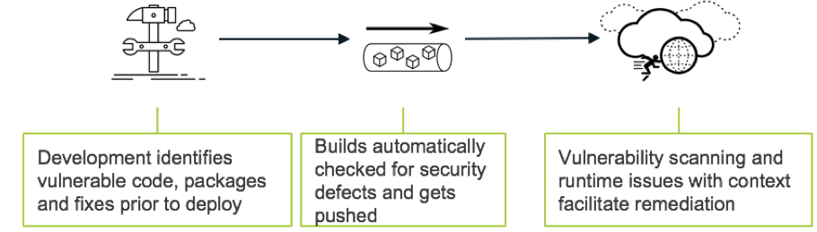
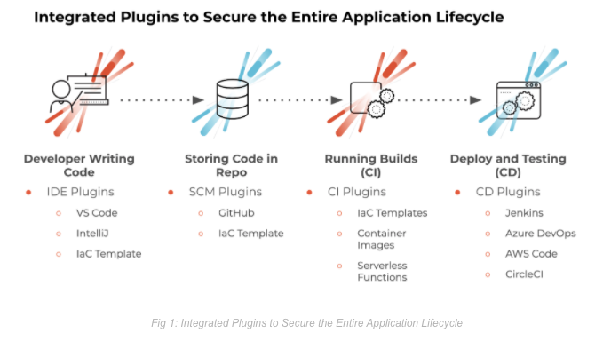
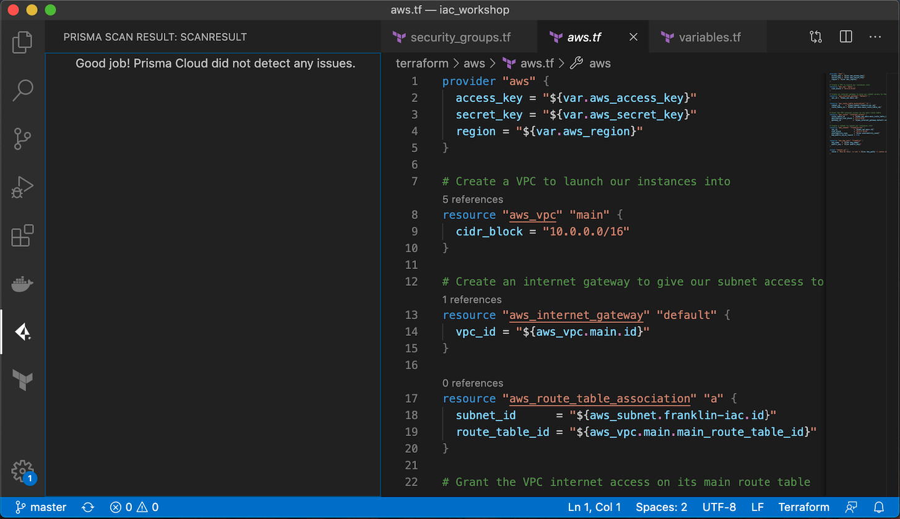

---
@title[Shifting Left]

@snap[north span-100 text-20 text-bold text-center text-orange]
Shifting Left
@snapend

@snap[midpoint span-100 text-11 text-center text-orange]
More security, earlier in the software development life cycle
@snapend

@snap[south-east span-45]

@snapend

---?image=assets/img/light_left.jpeg
@title[Introduction]

@snap[north-west span-100 text-20 text-bold text-center text-orange]
Introduction
@snapend

@snap[south-west span-35 text-08]
@box[text-orange](You can [follow along on GitPitch](https://gitpitch.com/hotpeppersec/shifting_left/master?p=palo_alto#/) if you like)
@snapend

@snap[south span-35 text-08]
@box[text-orange](Please use ["issues" for feedback/error reporting](https://github.com/hotpeppersec/shifting_left/issues))
@snapend

@snap[south-east span-35 text-08]
@box[text-orange](OK to interrupt w/questions [or send me a tweet](https://twitter.com/TheDevilsVoice))
@snapend

@snap[midpoint]

@snapend

Note:

- You can **follow along** with this talk on my github (hotpeppersec).
  - There are links throughout the presentation that you can click on for greater detail.
- I realize this presentation is currently a bit wonky when viewed on a mobile device.
  - I'm working on it, don't @ me.
- Please do provide feedback via "issues"
- My speaking style is fairly informal and if you stop me with a question I will do my best to answer it.
- [issues](https://github.com/hotpeppersec/shifting_left/issues)
- I will attempt to strike a balance begtween tactical and logistical concerns

---?image=assets/img/black_and_blue.jpeg
@title[Bio]

@snap[west]

@snapend

@snap[north-east span-45 text-08]
@box[text-yellow](Current Work#Consulting Engineer at Palo Alto Networks)
@snapend

@snap[east span-45 text-06]
@box[text-yellow](Previous Work#- Motorola - R&D Eng at Nokia Siemens - SecDataSci [@SecureCloudDev](https://twitter.com/SecureCloudDev))
@snapend

@snap[south-east span-45 text-08]
@box[text-yellow](Education#- MS DePaul University - MS Northwestern - BS in Comp Sci)
@snapend

Note:

- CE gets called in to assist SE's as a subject matter expert.
- Tech Lead in cellular base station product dev at Moto.
- Bought out by NSN
- Wound up at Salesforce doing security data science.
  - In-house log aggregation solution for sec logs
  - Our team used ML to deal with 1B security logs per day.
- MS in network eng, network security

---?image=assets/img/light_left.jpeg
@title[What]

@snap[north-west span-100 text-20 text-bold text-center text-orange]
Shift What?
@snapend

@snap[midpoint span-80]

@snapend

@snap[south-west span-35 text-08]
@box[text-orange](Address bugs and issues at the earliest.)
@snapend

@snap[south span-35 text-08]
@box[text-orange](Early amalgamation of security & dev concerns.)
@snapend

@snap[south-east span-35 text-08]
@box[text-orange](Not always (never?) the same set of goals!)
@snapend

Note:

- This talk comes at it from the viewpoint of a sec person who needs to get the dev teams on board.
- we often hear that sec is **everyones responsibility**
  - Resolve issues sooner than w/traditional methods.
- The impact of software issues (bugs) is amplified as we move down the path of software lifecycle.
  - Reduce the imact, costs, and likelihood of security issues by identifying and correcting sooner.

---?image=assets/img/light_left.jpeg
@title[Agile]

@snap[north-west span-100 text-20 text-bold text-right text-orange]
Adopt Agile Practices
@snapend

@snap[midpoint span-60]

@snapend

@snap[south-west span-35 text-08]
@box[text-orange](Use agile to align with dev teams) if you like)
@snapend

@snap[south span-35 text-08]
@box[text-orange](Cherrypick the best "ways of working")
@snapend

@snap[south-east span-35 text-08]
@box[text-orange](It's a direction, not a destination)
@snapend

Note:

- I stole this image from stackify.com
  - I'm sure whatever they sell is cool so go check them out.
- Choose/complement the agile processes that work for your team.
- Move toward security as code

---?image=assets/img/light_left.jpeg
@title[Palo Alto Plugins]

@snap[north-west span-100 text-20 text-bold text-center text-orange]
Lots of Plugins!
@snapend

@snap[south-west span-30 text-08]
@box[text-orange bg-yellow rounded box-padding]([4 Practical Steps for ‘Shift Left’ Security](https://blog.paloaltonetworks.com/2019/07/4-practical-steps-shift-left-security/))
@snapend

@snap[south span-30 text-08]
@box[text-orange bg-yellow rounded box-padding]([App Development with DevOps Plugins](https://blog.paloaltonetworks.com/2020/03/cloud-devops-plugins/))
@snapend

@snap[south-east span-30 text-08]
@box[text-orange bg-yellow rounded box-padding]([Prisma Cloud Plugins](https://docs.paloaltonetworks.com/prisma/prisma-cloud/prisma-cloud-admin/prisma-cloud-devops-security/prisma-cloud-plugins.html))
@snapend

@snap[midpoint span-60]

@snapend

Note:

- Palo Alto has a wealth of good information about helping your customer to shift left.
  - Some product specific, some general in nature.
  - This diagram is from a March '20 blog post by Pradnesh Patil

---?image=assets/img/light_left.jpeg
@title[VSCode_Demo]

@snap[north-west span-100 text-20 text-bold text-center text-orange]
Visual Studio Code Plugin
@snapend

@snap[midpoint]

@snapend

@snap[south-west span-35 text-08]
@box[text-orange](Palo Alto Networks can help with security during development)
@snapend

@snap[south-east span-35 text-08]
@box[text-orange](Here I am scanning some Terraform via VSCode plugin -> API)
@snapend

@snap[south span-35 text-08]
@box[text-orange](This is a decent solution because it is quick & easy)
@snapend

Note:

- Sorry I had some trouble sizing this screenshot.
- Terraform is used to automate infra provisioning on various cloud providers.
- In this shot I am using a remote API to scan my Terraform for security issues.
  - By the way there is a terraform linter available.
  - It's easy to run "terraform -validate" via CI!
- This is good but not great since it is voluntary rather than automated.

---?image=assets/img/light_left.jpeg
@title[People]

@snap[north-west span-100 text-20 text-bold text-center text-orange]
Key People at Palo Alto Networks
@snapend
